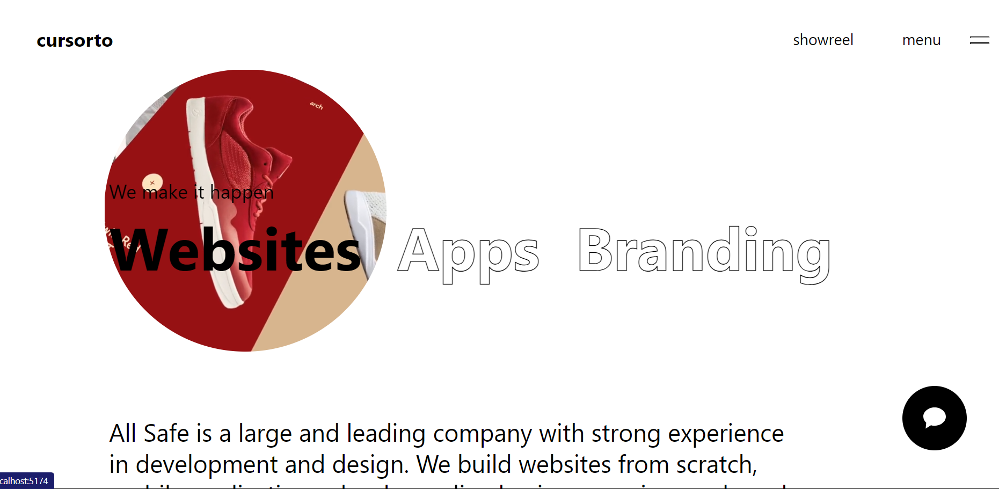
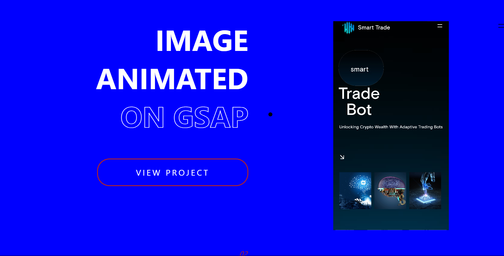

# All-Safe-Report Project Documentation

## Overview

The "All-Safe-Report" project is a modern web application developed using React.js and a variety of powerful libraries and tools. It focuses on providing an interactive and dynamic user experience, showcasing projects and development processes. The application is built with a modular approach, using components and context to manage state and behavior.

## Key Features

- **Dynamic Content Management:** Utilizes React state management for dynamic content, especially in managing the current video display.
- **Context API for State Management:** Implements React's Context API for efficient state propagation across components.
- **Modular Component Architecture:** Comprises reusable components like `Hero`, `Projects`, and `Development`.
- **Internationalization Support:** Integrated with `i18next` for multilingual support, enhancing global user accessibility.
- **Modern Animation and Graphics:** Incorporates libraries like GSAP and React Three Fiber for animations and 3D graphics.

## Technical Stack

### Main Dependencies

- **React (`react`, `react-dom`):** Core library for UI development.
- **@emotion/css:** For writing CSS styles in JavaScript.
- **@gsap/react, @react-three/fiber, @react-three/drei:** For animations and 3D graphics.
- **i18next and related plugins:** For internationalization and language detection.
- **three:** JavaScript 3D library.

### Development Dependencies

- **Typescript (`typescript`):** Adds strong typing to JavaScript.
- **Vite (`vite`):** Frontend tooling for efficient development.
- **ESLint and plugins:** Ensures code quality and consistency.
- **Sass (`sass`):** CSS preprocessor scripting language.

### Scripts

- **dev:** Starts the Vite development server.
- **build:** Compiles TypeScript and builds the project.
- **lint:** Lints the codebase.
- **preview:** Previews the production build.

## Component Structure

1. **`App`:** Root component, managing state for the current video using `CursorContext`.
2. **`Hero`:** Displays prominent content, likely the landing section.
3. **`Projects`:** Showcases projects or work samples.
4. **`Development`:** Presents development process or ongoing projects information.

## Context

- **`CursorContext`:** Manages and shares the current video state across components, avoiding prop drilling.

## Development and Deployment

Clone the repository and install dependencies to start development. Use the `dev` script for the development server. For production, use the `build` script, ensuring a clean build.

### Screenshots

## Conclusion

The "All-Safe-Report" project is a modern React application that excels in delivering a rich user experience with a focus on interactivity, dynamic content management, and scalable architecture, making it ideal for a global audience.
